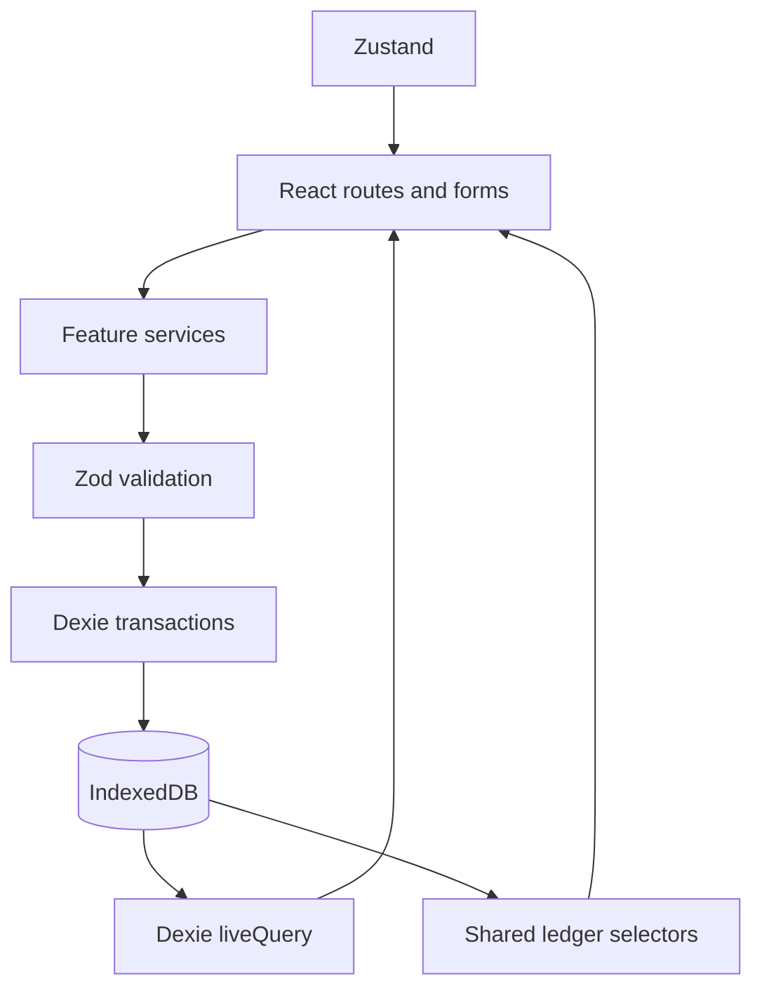

# My Finance — AI context and handoff

> Read this file first. It is the permanent AI-readable context for this repository. It describes the actual code, not just the product plan. Status labels: **VERIFIED**, **PLANNED**, **UNKNOWN**, **ASSUMPTION**.

---

## 1. Project identity

| Item | Value | Status |
| --- | --- | --- |
| Project name | My Finance | VERIFIED |
| npm package | `my-finance` | VERIFIED |
| Repository | `https://github.com/jagdishsah126/My_Expenditure` | VERIFIED |
| Current version | `0.1.0` in `package.json`; product status is **V1 candidate** | VERIFIED |
| Main platform | Mobile browser + installable PWA; desktop also works | VERIFIED |
| Target user | Single personal user tracking NPR across cash, banks, wallets and cash-like investment accounts | VERIFIED |
| Deployment | Vercel configuration exists, but no production domain/deployment was verified | UNKNOWN |
| Current status | Core V1 implemented and tested; ready for real-world trial, with documented limits | VERIFIED |

**What it does:** My Finance records accounts, opening balances, expenses, income, transfers, reconciliation adjustments, categories, tags, monthly confirmations, charts, backups and reviewed statement imports.

**Why it exists:** The primary product requirement is fast, accurate daily money tracking without requiring the user to re-enter every account balance each month.

**Primary goal:** Reliable personal money tracking first; visual polish and advanced features second.

---

## 2. Project philosophy

Derived from `doc/plan.md`, `doc/Step.md`, `doc/Decisions.md` and the implementation:

1. **Reliability > simplicity > speed > fancy features.** A beautiful finance app that loses or double-counts money is useless.
2. **The ledger is the only source of financial truth.** Screens must not maintain independent editable balance state.
3. **Monthly confirmation must never create money.** Existing balances are calculated and shown; the user confirms once.
4. **No silent financial history changes.** Balance corrections are explicit dated adjustment entries.
5. **Transfers are not income or expenses.** One transfer record has two account effects and zero effect on total owned money.
6. **Local-first privacy.** No login, backend, bank API, analytics, telemetry, cloud sync or automatic upload.
7. **Offline-first.** After the production shell is loaded/installed, the app and local data must work without internet.
8. **Mobile-first.** Bottom navigation, large touch targets, fast transaction entry, responsive charts and 360px layout support.
9. **Imports must be reviewed.** Parsing/preview must not write financial records; commit requires explicit user confirmation.
10. **Backup is essential.** Browser storage can be erased, so JSON backup/restore is part of the product, not an optional extra.

---

## 3. Tech stack

| Area | Technology | Purpose | Status |
| --- | --- | --- | --- |
| Framework | React 19 | UI and routing components | Current |
| Language | TypeScript, strict mode | Type safety for financial records | Current |
| Build tool | Vite 7 | Development and production build | Current |
| Styling | Tailwind CSS 4 + `@tailwindcss/vite` | Mobile-first styling and theme tokens | Current |
| Routing | React Router DOM 7 | Browser routes and SPA navigation | Current |
| Database wrapper | Dexie 4 | IndexedDB tables, transactions and live queries | Current |
| Storage | Browser IndexedDB | Authoritative local financial data | Current |
| Validation | Zod 4 | Persistence and import/backup validation | Current |
| UI state | Zustand 5 | Add-dialog state only | Current |
| Charts | Recharts 3 | Offline bundled charts | Current |
| XLSX | SheetJS CE `xlsx` 0.20.3 from official tarball URL | Local XLSX statement parsing | Current |
| CSV | Custom bounded parser in `src/features/import/parser.ts` | Local CSV statement parsing | Current |
| PWA | `vite-plugin-pwa` + Workbox | Manifest, installability, asset precache, offline shell | Current |
| Unit tests | Vitest 4 + `fake-indexeddb` | Ledger, schema, service, import and backup tests | Current |
| E2E tests | Playwright mobile Chromium | Real browser, PWA and financial-flow verification | Current |
| Lint/format | ESLint 9 + Prettier 3 | Code quality | Current |
| Deployment | Vercel rewrite config | Planned hosting target; config exists | PLANNED |
| PDF parsing | None in V1 | Explicit placeholder only | PLANNED later |
| PapaParse | Mentioned in planning docs, not installed or used | Do not assume it exists | Not current |

---

## 4. Architecture

### High-level shape



- **UI:** React routes in `src/app/app.tsx`, feature pages under `src/features/*/`.
- **Feature services:** validated write operations for accounts, transactions, monthly confirmation, import and backup.
- **Ledger:** pure selectors in `src/features/ledger/selectors.ts` calculate balances and reports from transaction arrays.
- **Persistence:** Dexie/IndexedDB in `src/db/database.ts`; Zod schemas in `src/db/schema.ts`.
- **UI state:** Zustand stores only whether the add-transaction dialog is open. It must never store balances or transactions.
- **Live updates:** `useLiveQuery` reads Dexie data and refreshes components after writes.
- **Code splitting:** non-home routes are lazy-loaded; Graphics and Import are large chunks. Workbox precaches the chunks for offline use.

### Startup flow

1. `src/main.tsx` opens `db`.
2. `initializePreferences(db)` validates or creates the `preferences` setting.
3. `seedDefaults(db)` seeds built-in account types and default categories once.
4. React renders `App`.
5. If preferences cannot be parsed or IndexedDB is unavailable, startup shows a local-storage error instead of overwriting data.

### Financial write flow

1. A form produces a draft.
2. A feature service validates references and financial invariants.
3. Zod validates the final persisted record.
4. A Dexie transaction commits all related writes atomically.
5. Backdated changes update `monthlyConfirmations.openingChangedSinceConfirmation` when appropriate.
6. Live queries re-render screens.
7. Balances are recalculated by shared ledger selectors, not from cached balance state.

### Import flow

`file → local parser → staged rows → mapping → editable preview → duplicate warnings → explicit commit → atomic Dexie transaction`

Preview uses a `WeakMap` to bind the immutable preview to the database and draft. Commit revalidates and rechecks duplicates. Invalid/unresolved rows cannot be committed.

### Backup/restore flow

`read all tables → validate → plaintext JSON download` for export.

`select JSON → validate schema/references → preview counts/dates → type REPLACE_ALL_DATA → one atomic replace-all transaction` for restore.

---

## 5. Directory structure

```text
.
├── doc/                         # Product, implementation, decision and user docs
├── e2e/                         # Playwright mobile browser tests
├── public/                      # Static PWA icons and favicon
├── src/
│   ├── app/                     # App shell, routes, 404 page
│   ├── components/ui/           # Small reusable UI primitives
│   ├── db/                      # Dexie database, schemas, preferences repository
│   ├── features/
│   │   ├── accounts/            # Account types, accounts, archive, defaults, UI
│   │   ├── backup/              # JSON/CSV export and replace-all restore
│   │   ├── categories/          # Categories, subcategories, ordering, tags, UI
│   │   ├── dashboard/           # Home page
│   │   ├── graphics/            # Date ranges, aggregations, Recharts UI
│   │   ├── import/              # CSV/XLSX parser, mapping, preview, commit, UI
│   │   ├── ledger/              # Shared balance/report selectors and tests
│   │   ├── monthly/             # Kathmandu month detection and confirmation
│   │   ├── settings/            # Preferences and data tools page
│   │   └── transactions/        # Transaction writes, form, history UI
│   ├── stores/                  # UI-only Zustand store
│   ├── test/                    # Vitest setup (fake IndexedDB)
│   ├── utils/                   # Exact money and Kathmandu date utilities
│   ├── main.tsx                 # Startup and default seeding
│   └── styles.css               # Tailwind theme and global accessibility styles
├── vite.config.ts               # Vite, Tailwind and PWA config
├── vitest.config.ts             # Unit test config
├── playwright.config.ts         # E2E config
├── vercel.json                  # SPA fallback rewrite
└── package.json                 # Scripts and dependencies
```

---

## 6. Important files

| File | Purpose | Important notes |
| --- | --- | --- |
| `src/db/database.ts` | Dexie database definition | Schema version 2; all eight tables and indexes |
| `src/db/schema.ts` | Zod persistence schemas | Transaction union, NPR-only account schema, confirmation schema |
| `src/features/ledger/selectors.ts` | Shared financial calculations | Must be used for balances/reports; do not duplicate formulas |
| `src/utils/money.ts` | Integer paisa parse/format/add | Never use floats for authoritative money |
| `src/utils/dates.ts` | Kathmandu calendar helpers | Month/date boundaries must not come from UTC timestamps |
| `src/features/accounts/service.ts` | Account/type writes and archive | Creates account + one opening atomically; zero-balance archive |
| `src/features/categories/service.ts` | Category/tag writes | Prevents hierarchy cycles and destructive referenced deletes |
| `src/features/transactions/service.ts` | Transaction create/update/delete | Validates references and flags changed confirmed openings |
| `src/features/monthly/service.ts` | Month confirmation | Metadata only; idempotent; no balance writes |
| `src/features/backup/index.ts` | Backup/restore/CSV export | Backup format version 1; strict validation and atomic replace-all |
| `src/features/import/parser.ts` | CSV/XLSX local parsing | Bounded files/rows/cells; PDF rejected; XLSX ZIP safety checks |
| `src/features/import/mapping.ts` | Statement column mapping and staged rows | Debit/credit direction is explicit; saved mappings use column names |
| `src/features/import/service.ts` | Import preview and atomic commit | Preview is read-only; commit rechecks duplicates and provenance |
| `src/app/app.tsx` | App shell and routes | Bottom nav, lazy routes, PWA update prompt, network notice |
| `src/features/dashboard/HomePage.tsx` | Home dashboard | Uses shared ledger selectors and month confirmation UI |
| `src/features/transactions/TransactionsPage.tsx` | History and add/edit dialog | Search/filter, edit/delete, transfer display |
| `src/features/graphics/aggregations.ts` | Chart data | Uses shared ledger for balances/income/expense where applicable |
| `vite.config.ts` | PWA/build config | Manifest, icons, Workbox precache, SPA offline fallback |
| `src/main.tsx` | Startup | Preferences initialization and one-time default seeding |
| `doc/Decisions.md` | Financial contracts | Locked product decisions and worked acceptance examples |
| `doc/guide.md` | User guide | Feature usage and first-month manual test checklist |
| `README.md` | Public overview/run instructions | Keep updated with actual commands and status |

---

## 7. Core features

### Implemented and verified

#### Accounts and account types

- Built-in types: Cash, Bank, Digital Wallet, Investment, Other.
- Custom account types with optional icons.
- Multiple accounts of the same type.
- Account fields include name, type, icon, notes, active flag and timestamps.
- Creating an account also creates exactly one dated opening transaction atomically.
- Account detail/edit and account history.
- Archive requires zero current balance and no future-dated entries.
- Restore preserves history.
- Backdated changes that make an archived account nonzero are included in totals and warned in UI.

#### Categories, subcategories and tags

- Default expense and income categories/subcategories seeded once with stable IDs.
- Custom categories with type `expense`, `income` or `both`.
- Optional parent category and icon.
- Cycle prevention and parent/child compatibility checks.
- Reorder among siblings.
- Archive subtree and restore parent-first.
- Permanent delete only for unreferenced leaf categories.
- Tags normalize labels, deduplicate and prevent deletion while referenced.

#### Transactions

- Expense, income, transfer and adjustment writes through `transactions/service.ts`.
- Opening entries are created only through account creation/import commit, not normal transaction entry.
- Expense/income require positive amount, active account, compatible active category and date on/after account opening.
- Transfer requires two distinct active accounts and no category.
- Adjustment requires signed nonzero delta and reason.
- Optional time, remark and tags.
- Edit/delete for expense, income and transfer. Adjustments can be deleted but not edited in UI.
- Search/filter by text, account, category, tag, type, source, date range and amount range.
- Double-submit is disabled while saving.

#### Ledger and balances

- Integer paisa arithmetic; no authoritative floats.
- Shared selectors for account balance, total balance, income, expenses, transfers, adjustments, openings, month opening/closing and range summary.
- Current balance excludes future-dated records until their Kathmandu date.
- Archived nonzero accounts are included in total.
- Hand-checked fixture from `doc/Decisions.md` is encoded in tests.

#### Monthly confirmation

- Uses Asia/Kathmandu current month.
- Shows carried-forward active-account balances and separately lists new accounts created in the month.
- Confirmation stores only `monthKey`, `confirmedAt`, and `openingChangedSinceConfirmation`.
- Confirmation is idempotent and creates no transaction or balance.
- Only the current month prompts after missed months.
- Backdated create/edit/delete/import marks affected confirmed months as changed.

#### Reconciliation

- Account page shows calculated balance and accepts actual balance, date and reason.
- Creates a signed adjustment with before/after audit values.
- Adjustments affect balances but are not operating income/expense.

#### Dashboard

- Total current NPR balance.
- Current month income, expenses and operating net.
- Adjustments and new-account openings shown separately.
- Account balances.
- Recent transactions.
- Month confirmation and warning states.

#### Graphics

- Presets: This Month, Last Month, This Year, Last 3 Months, Last 6 Months, Custom Range.
- Expense trend with daily/weekly/monthly grouping.
- Income vs expense.
- Expense by top-level category.
- Account balances as of range end.
- Daily spending.
- Income sources.
- Spending by account.
- Accessible text/table summaries and tooltips.
- Charts are lazy-loaded and bundled for offline use.

#### Backup and restore

- Complete JSON export of all eight tables plus format/version metadata.
- Last export initiated timestamp stored in settings.
- Strict backup validation, duplicate ID/reference checks, safe integer checks and one-opening-per-account checks.
- Restore preview with counts and date coverage.
- Explicit `REPLACE_ALL_DATA` confirmation.
- Atomic replace-all restore; invalid/stale previews fail without writing.
- CSV transaction export with explicit transfer columns and spreadsheet-formula escaping.

#### CSV/XLSX statement import

- Local `.csv` and `.xlsx` parsing only.
- CSV limit 2 MB; XLSX limit 4 MB; up to 2,000 data rows; cell/column limits.
- XLSX ZIP metadata safety checks before workbook parsing.
- Column mapping for date, description, debit/credit or signed amount, reference and balance.
- Date formats: `YYYY-MM-DD`, `DD/MM/YYYY`, `MM/DD/YYYY`, Excel serial 1900.
- Account selection or new-account creation on commit.
- Editable row preview, skip/include, category assignment and duplicate decisions.
- Duplicate detection against existing rows and within the file.
- Saved column-name mappings.
- Atomic import with provenance in `sourceReference`.
- Running balance shown as advisory only, never forced.

#### PWA and offline

- Manifest and maskable icons.
- Workbox precaches app assets including lazy chunks.
- Offline reload and offline navigation verified in Playwright.
- PWA update prompt uses `registerType: "prompt"`.
- Local network status notice.
- Chromium installability check returned no errors in E2E.

### Planned / not implemented

- PDF statement parsing. V1 shows a disabled `PDF import — Under construction` box and does not read PDFs.
- Budgets and recurring transactions.
- Cloud backup, multi-device sync, encryption-at-rest service, account registration.
- Bank/wallet API integrations.
- Multi-currency totals or exchange rates.
- Portfolio holdings/market valuation; investment accounts are cash-like balances only.
- Automated category rules and institution-specific advanced import mappings.
- NEPSE integration, financial goals, notifications, advanced analytics.

---

## 8. Data model

Database: IndexedDB database name `my-finance`, Dexie schema version **2**.

### `accountTypes`

| Field | Type | Notes |
| --- | --- | --- |
| `id` | UUID string | Primary key |
| `name` | string | Required, trimmed |
| `icon` | string? | Optional |
| `isBuiltIn` | boolean | Built-ins cannot be deleted |
| `createdAt`, `updatedAt` | UTC ISO datetime | Audit timestamps |

Indexes: `&id`, `name`.

### `accounts`

| Field | Type | Notes |
| --- | --- | --- |
| `id` | UUID string | Primary key |
| `name` | string | Required |
| `accountTypeId` | UUID | References `accountTypes.id` |
| `currency` | literal `NPR` | V1 rejects other currencies |
| `icon`, `notes` | string? | Optional |
| `isActive` | boolean | `false` means archived |
| `createdAt`, `updatedAt` | UTC ISO datetime | Audit timestamps |

Indexes: `&id`, `accountTypeId`, `isActive`.

### `categories`

| Field | Type | Notes |
| --- | --- | --- |
| `id` | UUID string | Primary key |
| `name` | string | Required |
| `type` | `expense` / `income` / `both` | Compatibility enforced |
| `parentId` | UUID? | Parent category; cycles blocked |
| `sortOrder` | integer | Sibling ordering |
| `icon` | string? | Optional |
| `isActive` | boolean | Archived categories remain in history |
| `createdAt`, `updatedAt` | UTC ISO datetime | Audit timestamps |

Indexes: `&id`, `parentId`, `type`, `sortOrder`.

### `tags`

| Field | Type | Notes |
| --- | --- | --- |
| `id` | UUID string | Primary key |
| `label` | string | Unique normalized label |

Indexes: `&id`, `&label`.

### `transactions`

Common fields:

| Field | Type | Notes |
| --- | --- | --- |
| `id` | UUID string | Primary key |
| `date` | `YYYY-MM-DD` | Kathmandu calendar date |
| `time` | `HH:mm`? | Optional display/order time |
| `remark` | string? | Optional searchable text |
| `tagIds` | UUID[] | References tags |
| `source` | `manual` / `bank_statement` / `wallet_statement` / `imported` | Provenance |
| `sourceReference` | string? | Import provenance/reference |
| `createdAt`, `updatedAt` | UTC ISO datetime | Audit timestamps |

Variants:

| Type | Required fields | Financial effect |
| --- | --- | --- |
| `opening` | `accountId`, nonnegative `amountPaisa` | `+amount` to account; one per account |
| `income` | `accountId`, `categoryId`, positive `amountPaisa`; optional `subcategoryId` | `+amount` to account |
| `expense` | `accountId`, `categoryId`, positive `amountPaisa`; optional `subcategoryId` | `−amount` from account |
| `transfer` | `fromAccountId`, `toAccountId`, positive `amountPaisa` | `−amount` source, `+amount` destination |
| `adjustment` | `accountId`, nonzero signed `deltaPaisa`, `reason`; optional audit values | `+delta` to account |

Adjustment audit fields: `calculatedBeforePaisa?`, `actualAtTimePaisa?`.

Indexes include: `&id`, `date`, `type`, `accountId`, `fromAccountId`, `toAccountId`, `categoryId`, `[accountId+date]`, `[fromAccountId+date]`, `[toAccountId+date]`.

### `monthlyConfirmations`

| Field | Type | Notes |
| --- | --- | --- |
| `monthKey` | `YYYY-MM` | Primary key |
| `confirmedAt` | UTC ISO datetime | Original confirmation timestamp is preserved |
| `openingChangedSinceConfirmation` | boolean | Set by backdated changes before month start |

This table stores metadata only, not balances.

### `importMappings`

| Field | Type | Notes |
| --- | --- | --- |
| `id` | UUID string | Primary key |
| `name` | string | User-visible mapping name |
| `format` | `csv` / `xlsx` | File format |
| `columns` | `Record<string,string>` | Column names, not statement data |
| `updatedAt` | UTC ISO datetime | Audit timestamp |

### `settings`

Generic table:

| Field | Type | Notes |
| --- | --- | --- |
| `key` | string | Primary key |
| `value` | unknown JSON | Setting payload |
| `updatedAt` | UTC ISO datetime | Audit timestamp |

Known keys:

- `preferences` → `{ reduceMotion: boolean }`
- `lastExportInitiated` → `{ at: string }`
- `seed:account-types:v1`
- `seed:categories:v1`

Unknown setting keys may be preserved by backup if they are valid JSON.

### Versioning and migrations

- Dexie version 1: `settings` only.
- Dexie version 2: all current tables.
- A migration test verifies version-1 preferences survive upgrade to version 2.
- No later Dexie versions exist.
- JSON backup format version is **1** and is separate from Dexie version.

---

## 9. Business logic that must not be broken

### Money

- Store money as safe integer paisa (`Rs 100.50 = 10050`).
- Parse decimal input exactly with at most two decimal places.
- Reject empty, negative where positive is required, zero normal transactions, NaN, Infinity, comma input in normal forms, excess precision and unsafe totals.
- Zero is valid only for opening balances.
- Display using `formatNpr`; never interpolate float arithmetic for money.

### Dates

- Ledger dates are `YYYY-MM-DD` calendar days in Asia/Kathmandu.
- Month keys are `YYYY-MM` in Asia/Kathmandu.
- UTC ISO timestamps are audit metadata only.
- Month ranges are `[monthStart, nextMonthStart)`.
- User-facing custom end dates are inclusive and converted to exclusive boundaries.
- Future-dated transactions appear in history but do not affect current balances until their Kathmandu date.

### Balance calculation

For an account before an exclusive end date:

```text
opening + income - expense + incoming transfers - outgoing transfers + adjustments
```

Total balance is the sum across owned NPR accounts, including a nonzero archived account if history made it nonzero.

### Transfer rule

A transfer is one record. It must not be converted into an expense plus income. It changes account balances but not total money.

### Monthly confirmation

- Confirmation stores metadata only.
- It must be idempotent.
- It must not create an opening transaction or duplicate balances.
- Only current month prompts after absences.
- Backdated changes before a confirmed month start set `openingChangedSinceConfirmation`.

### Opening entries

- Every account requires exactly one opening transaction.
- Creating account + opening is atomic.
- Normal transaction create/update/delete refuses opening records.
- Imports predating an account opening must fail until the opening is deliberately corrected.

### Archive rule

- Current balance must be exactly zero.
- Future-dated entries block archiving.
- Archived accounts/categories remain visible in historical records.
- Do not hide nonzero archived balances from totals.

### Categories

- Parent/child types must be compatible.
- Hierarchies must not cycle.
- Referenced categories cannot be destructively deleted.
- Type changes are blocked when they would invalidate children or references.

### Reconciliation

- Use an adjustment, not direct balance mutation.
- Adjustment is not income/expense.
- Audit values are creation-time values and must not be rewritten.

### Import

- Preview must never write.
- Debit and credit cannot be mapped to one directionless amount.
- Duplicates need explicit Skip or Keep Both.
- Commit rechecks duplicates and writes atomically.
- One statement side cannot be treated as a proven internal transfer.
- PDFs must not be read in V1.

### Backup/restore

- JSON is the only lossless backup.
- Restore is replace-all only; no merge.
- Invalid restore files must leave the database untouched.
- Existing data changing after preview makes the preview stale.

---

## 10. UI/UX rules

- Mobile bottom navigation: Home, Transactions, Graphics, Accounts, Settings.
- Desktop uses a left sidebar.
- Floating `+` opens Expense / Income / Transfer entry.
- Theme tokens in `src/styles.css`:
  - `forest` `#113d30`
  - `leaf` `#d9eecf`
  - `paper` `#f3f7f1`
  - `ink` `#19382e`
- System font stack; no runtime webfont dependency.
- Cards use white backgrounds, rounded corners and subtle borders.
- Primary buttons use `forest`; destructive restore uses red.
- Forms use large controls (`min-h-11`/`min-h-12`) and mobile-friendly inputs.
- Empty states explain what to do next instead of showing fake financial data.
- Errors use `role="alert"`; loading states use `role="status"`.
- Transaction overlays are custom fixed dialogs with Escape/backdrop close; the unused `Modal.tsx` is a legacy primitive.
- Focus outlines and reduced-motion preference are implemented globally and in Settings.
- 360px layout is E2E-tested for horizontal overflow.

---

## 11. Important / locked decisions

1. **NPR-only aggregation in V1.** Multi-currency totals require exchange-rate policy and are V2+.
2. **Asia/Kathmandu calendar boundaries.** Prevents month assignment changing when the device travels or UTC differs.
3. **Integer paisa.** Prevents floating-point money errors.
4. **Ledger-derived balances.** Monthly confirmations and UI state must not become parallel balance ledgers.
5. **One opening per account.** Prevents repeated monthly setup and duplicate balance creation.
6. **Zero-balance archive.** Prevents accounts with money disappearing from active totals.
7. **One canonical transfer.** Prevents double-counting and transfer edits becoming inconsistent.
8. **Replace-all restore.** Merging two complete backups is unsafe in V1.
9. **No PDF parser in V1.** The owner explicitly chose a placeholder instead of unreliable generic parsing.
10. **Official SheetJS tarball.** Public npm `xlsx` was documented as outdated; `0.20.3` is pinned from SheetJS CDN and reports Apache-2.0.
11. **Custom CSV parser instead of PapaParse.** Planning mentioned PapaParse, but actual code uses a strict bounded local parser. The reason for this deviation is not documented; do not assume PapaParse APIs.
12. **No backend/auth/analytics in V1.** Privacy and simplicity requirements.

Changes to schema, backup format, money representation, transfer semantics or month confirmation require migration and product-owner review.

---

## 12. Constraints

- Single user, single browser profile, no cross-device sync.
- IndexedDB is required; private browsing/storage eviction can lose data.
- First PWA load requires network; offline works after assets are cached.
- Production installation requires HTTPS; localhost is acceptable for testing.
- All import parsing is local and bounded; very large statements are intentionally rejected.
- No runtime CDN dependency for core app behavior.
- Recharts and SheetJS are bundled, increasing precache size (~1.3 MB build output at analysis).
- Browser Router deployment needs SPA fallback to `index.html`.
- No `.env` configuration is currently used.

---

## 13. Current status

### Completed

Verified by code and tests:

- Vite/React/TypeScript/Tailwind app shell.
- PWA manifest, service worker, offline reload and update prompt.
- Dexie schema and migration test.
- Preferences and one-time defaults seeding.
- Accounts/account types/opening/archive/restore.
- Categories/subcategories/icons/reorder/archive/restore/tags.
- Expense/income/transfer/adjustment write services.
- Transaction history, search/filter, edit/delete.
- Shared ledger selectors and financial invariant tests.
- Monthly confirmation and changed-opening metadata.
- Reconciliation adjustment creation.
- Dashboard.
- Graphics and date ranges.
- JSON backup/restore and CSV export.
- CSV/XLSX reviewed import and duplicate detection.
- PDF placeholder.
- Documentation and user guide.
- Route-level code splitting.

### In progress

- No active code feature branch was found.
- Product is in real-world trial / V1 candidate review.

### Planned

See section 7: PDF parsing, budgets, recurring transactions, sync/cloud, multi-currency, portfolio tracking, advanced mappings/rules, notifications and other V1.1/V2 items.

### Known issues / limitations

| Issue | Status | Notes |
| --- | --- | --- |
| Production deployment not verified | UNKNOWN | `vercel.json` exists; no deployed domain tested |
| Physical phone installation not verified | UNKNOWN | Chromium installability/offline E2E passes, but no real-device test was performed |
| Reconciliation stale-audit warning missing | VERIFIED gap | Decisions say changed earlier activity should flag reconciliation for review; code flags changed month openings but does not compare adjustment audit values later |
| Adjustment edit UI missing | VERIFIED limitation | Adjustments can be deleted/recreated, not edited |
| `src/components/ui/Modal.tsx` unused | VERIFIED technical debt | Current transaction dialogs are custom overlays |
| No transaction pagination/virtualization | VERIFIED limitation | Acceptable for normal personal data; large histories may need optimization |
| No comprehensive screen-reader audit | UNKNOWN | Basic semantics, focus, labels and summaries exist |
| Build emits Zod annotation warnings | VERIFIED non-fatal | Rollup removes unsupported dependency comments; build succeeds |
| PDF import absent | VERIFIED intentional | Placeholder only |
| PapaParse absent despite plan mention | VERIFIED deviation | Actual custom parser is the source of truth |

### Technical debt

- Add reconciliation audit-staleness detection if the decisions contract remains desired.
- Consider editing adjustments safely instead of delete/recreate.
- Add pagination/virtualized lists for very large histories.
- Consider removing or reusing `Modal.tsx`.
- Add more real-device PWA/storage-eviction testing.
- Consider performance measurement before introducing any derived balance cache.

---

## 14. Development workflow

### Before modifying code

1. Read this file completely.
2. Read `doc/Decisions.md` for financial invariants.
3. Inspect the relevant service and UI files, not only README.
4. Identify whether the change affects schema, backup format, money, dates, transfer semantics or monthly confirmation.
5. If it does, document migration/data implications before coding.
6. Check existing tests and fixtures before adding parallel logic.

### While implementing

- Keep changes focused.
- Reuse `utils/money.ts`, `utils/dates.ts` and ledger selectors.
- Validate at service boundaries with Zod.
- Use Dexie transactions for multi-table writes.
- Do not put financial records in Zustand.
- Do not query or calculate balances independently inside screens.
- Preserve offline behavior; do not add runtime network dependencies.
- Update tests with financial logic changes.

### After implementing

Run the relevant checks:

```bash
npm run typecheck
npm run lint
npm run format:check
npm test
npm run build
npm run test:e2e
```

For import/backup changes, also run `npm audit --audit-level=moderate` and test malformed files.

### Files usually modified

- Feature service and matching test file
- Feature page/component
- E2E test for user flow changes
- Documentation if behavior or architecture changes

### Files requiring extra caution

- `src/db/schema.ts`
- `src/db/database.ts`
- `src/features/ledger/selectors.ts`
- `src/features/transactions/service.ts`
- `src/features/monthly/service.ts`
- `src/features/backup/index.ts`
- `src/features/import/*`
- `vite.config.ts`

Do not change these without understanding migrations, backups and financial invariants.

---

## 15. Commands

```bash
npm ci                      # clean install from package-lock
npm run dev                 # Vite development server
npm run build               # typecheck + production build
npm run preview             # serve production build
npm run typecheck           # TypeScript project check
npm run lint                # ESLint
npm run format:check        # Prettier check
npm run format              # Prettier write
npm test                    # Vitest unit/integration tests
npm run test:e2e            # Playwright mobile Chromium tests
npm audit --audit-level=moderate
npx playwright install chromium
```

Production-like local PWA test:

```bash
npm run build
npm run preview -- --host 127.0.0.1 --port 4173
```

Open `http://127.0.0.1:4173`.

---

## 16. Environment variables

| Variable | Purpose | Required | Safe to expose? |
| --- | --- | --- | --- |
| None | The app has no runtime environment configuration | No | N/A |

- No `.env` or `.env.example` exists.
- `.gitignore` excludes `.env` files if added later.
- Do not introduce secrets into frontend code.

---

## 17. Deployment

- Repository remote: `origin https://github.com/jagdishsah126/My_Expenditure.git`.
- Intended host: Vercel.
- Build command: `npm run build`.
- Output directory: `dist`.
- SPA fallback: `vercel.json` rewrites all paths to `/index.html`.
- HTTPS is required for production PWA installation.
- No deployed production URL was verified.
- After deployment, test:
  1. First online load.
  2. Installation prompt/install.
  3. Offline reload.
  4. Offline transaction entry.
  5. Service-worker update prompt.
  6. Database persistence across update.

---

## 18. Testing and verification

### Automated tests

At analysis time:

- `npm run typecheck` — passed.
- `npm run lint` — passed.
- `npm run format:check` — passed.
- `npm test` — **47/47 passed** across 8 test files.
- `npm run build` — passed; non-fatal Zod annotation warnings.
- `npm run test:e2e` — **8/8 passed** in mobile Chromium.
- `npm audit --audit-level=moderate` — 0 vulnerabilities.

### Unit/integration coverage

- Preferences and schema upgrade.
- Exact paisa parsing/formatting and Kathmandu dates.
- Ledger fixture, transfer, adjustments, archived balances, future dates and overflow.
- Account/type/category/tag services.
- Transaction writes and monthly metadata.
- Backup validation, restore rollback and CSV escaping.
- CSV/XLSX parsing, mapping, duplicates and atomic import.

### E2E coverage

- Mobile shell and preference persistence.
- PWA manifest/installability/offline reload.
- 360px overflow.
- Account creation.
- Expense, income, transfer and transfer-total invariant.
- Graphics load.
- Month confirmation idempotence.
- Archive blocking and reconciliation.
- JSON/CSV export and replace-all restore.
- Reviewed CSV import.

### Manual flows to retest after significant changes

Use `doc/guide.md` section 13. Minimum after financial changes:

1. Create two accounts with known openings.
2. Add expense and income; verify balances.
3. Transfer between accounts; verify total unchanged.
4. Confirm a new month twice/reload; verify no balance change.
5. Reconcile one account; verify adjustment.
6. Backdate/edit a transaction; verify month warning.
7. Export JSON, delete test data, restore.
8. Import a small CSV with a duplicate row.
9. Reload offline.

---

## 19. Known problems and lessons learned

1. **SheetJS distribution:** Do not blindly `npm install xlsx`; public npm was documented as outdated. The project pins official `0.20.3` from `https://cdn.sheetjs.com/...`.
2. **XLSX dense parsing:** An initial import implementation read SheetJS dense worksheets incorrectly. The parser now uses normal cell-object access and tests formulas/corrupt ZIP/row limits.
3. **TypedArray TypeScript issue:** SheetJS bytes needed explicit `Uint8Array` handling in tests to satisfy current TypeScript DOM typings.
4. **Import test order:** Do not rely on Dexie `toArray()` insertion order for assertions; sort before comparing.
5. **Generated code must be reviewed:** Background helper agents once left partial import code with failing tests. The project now treats all generated code as unverified until typecheck, lint, unit and E2E tests pass.
6. **PWA code splitting:** Recharts and SheetJS initially inflated the main bundle. Routes are now lazy-loaded; Workbox still precaches chunks for offline use.
7. **Zod build warnings:** Rollup prints warnings about unsupported pure annotations in Zod. They are non-fatal and should not be mistaken for build failure.
8. **Browser download proof:** The app can record `Last export initiated`, but cannot prove the user saved the file. Preserve that wording.
9. **Statement transfer ambiguity:** Bank debit + wallet credit cannot be auto-linked safely. V1 deliberately avoids transfer inference.
10. **Backup strictness:** Backup restore intentionally rejects normalized/dropped values and stale previews to avoid pretending a lossy restore was lossless.

---

## 20. AI coding rules

### Before changing code

- Read `doc/AI.md` and `doc/Decisions.md`.
- Inspect actual code and tests for the area being changed.
- Treat locked financial decisions as intentional.
- Do not assume planned features exist.
- Do not rewrite working services because a different architecture is preferred.
- Do not add dependencies without checking bundle, privacy, offline and license implications.

### When implementing features

- Make the smallest clean change.
- Follow the existing feature-folder structure.
- Reuse shared utilities and ledger selectors.
- Keep financial data out of Zustand.
- Use one Dexie transaction for multi-record financial writes.
- Preserve Kathmandu dates and integer paisa.
- Preserve one canonical transfer.
- Preserve import preview-before-write and restore replace-all behavior.
- Add/update unit tests for services and E2E tests for user flows.
- Handle malformed input and show understandable errors.

### After changing code

- Run typecheck, lint, format check and unit tests.
- Build before E2E.
- Run relevant E2E tests.
- Check audit after dependency changes.
- Update `doc/AI.md` if features, architecture, dependencies, commands, constraints or decisions change.

---

# Instructions for a New AI Agent

1. Read `doc/AI.md` completely before making assumptions.
2. Inspect the relevant source code before modifying anything.
3. Treat the documented locked decisions as intentional unless the product owner explicitly changes them.
4. Do not assume planned features are implemented; verify actual code.
5. Preserve existing working behavior, especially ledger, transfer, monthly confirmation, import and backup invariants.
6. Make the smallest clean change necessary.
7. Do not introduce backend, authentication, analytics, cloud sync or bank APIs in V1.
8. Test/build after significant changes.
9. Update `doc/AI.md` when architecture, features, dependencies, commands or important decisions change.

---

# Context Accuracy

| Item | Value |
| --- | --- |
| Last analyzed date | 2026-10-07 |
| Repository HEAD at analysis | `bc6108ef65116654637c7382c10bd08c4831a7bb` (`Add user guide and organize documentation`) |
| `AI.md` status | New handoff document created after that commit |
| Generated by | Fledge Alpha Free (OpenCode) |
| Source of truth for this analysis | Actual source, config, docs, package files, tests and local verification runs |

### Verified during analysis

- **VERIFIED:** Repository structure, source code, schemas, services, pages, utilities, state, PWA config, backup/import logic, docs and scripts were inspected.
- **VERIFIED:** `npm run typecheck`, `npm run lint`, `npm run format:check`, `npm test` (47/47), `npm run build`, `npm run test:e2e` (8/8) passed.
- **VERIFIED:** `npm audit --audit-level=moderate` reported 0 vulnerabilities.
- **VERIFIED:** No `.env` file and no runtime HTTP URL usage in `src` were found.
- **VERIFIED:** Remote repository is `jagdishsah126/My_Expenditure`.

### Unknown or not fully verified

- **UNKNOWN:** Production Vercel deployment and final public domain.
- **UNKNOWN:** Physical phone/tablet installation and long-term browser storage behavior.
- **UNKNOWN:** Full screen-reader/accessibility audit beyond implemented semantics and automated checks.
- **UNKNOWN:** Exact reason the implemented CSV parser replaced the planned PapaParse dependency; only the actual implementation is verified.

### Assumptions

- **ASSUMPTION:** The current owner still wants the V1 limits documented in `doc/Decisions.md`, including no PDF parsing and NPR-only aggregation.
- **ASSUMPTION:** Normal personal transaction volume does not yet require pagination or derived balance caching.
